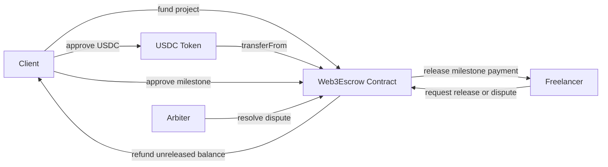

# Web3 Escrow Protocol

[](https://github.com/2hevva/web3-escrow-protocol/actions/workflows/contracts.yml)
[](https://github.com/2hevva/web3-escrow-protocol/actions/workflows/frontend.yml)
[](LICENSE)

Milestone-based stablecoin escrow for remote Web3 work.

This project models a practical payment flow between a client and a freelancer: the client funds the full budget in USDC, approves completed milestones, and releases payments as work is delivered. If delivery or payment becomes disputed, either participant can open a dispute and an arbiter can split the unreleased balance.

## Reviewer Quick Scan

If you are reviewing this as a Web3 engineering portfolio project, start here:

- Contract: [`src/Web3Escrow.sol`](src/Web3Escrow.sol)
- Contract tests: [`test/Web3Escrow.t.sol`](test/Web3Escrow.t.sol)
- Deployment script: [`script/Deploy.s.sol`](script/Deploy.s.sol)
- Frontend preview: [`components/EscrowDashboard.tsx`](components/EscrowDashboard.tsx)
- CI workflows: [contracts](.github/workflows/contracts.yml) and [frontend](.github/workflows/frontend.yml)
- Security posture: [`SECURITY.md`](SECURITY.md)

## Why This Project Matters

Remote crypto work often fails around trust, milestone clarity, and payment timing. This protocol demonstrates how a small smart contract can reduce that friction with transparent state transitions and stablecoin settlement.

For a Web3/blockchain engineering portfolio, this project shows:

- Solidity contract design for real payment flows
- ERC-20 token custody and release logic
- Milestone-based state management
- Dispute handling with an arbiter role
- Foundry testing direction for critical money movement paths
- Frontend product thinking around a concrete business use case

## Core Flow



## Smart Contract Features

- Client, freelancer, and arbiter roles
- Multi-milestone escrow setup
- ERC-20 funding with `transferFrom`
- Client-controlled milestone approval
- Participant-triggered release for approved milestones
- Participant-triggered dispute opening
- Arbiter-controlled dispute resolution
- Client cancellation before funding or refund of unreleased funded balance
- Custom errors and explicit status transitions
- Reentrancy guard around token transfers

## Tech Stack

| Layer | Technology |
| --- | --- |
| Smart contracts | Solidity |
| Contract tests | Foundry |
| Frontend | Next.js, React, TypeScript |
| Web3 integration | viem, wagmi, RainbowKit |
| Token flow | ERC-20 compatible stablecoin |

## Repository Structure

```text
src/Web3Escrow.sol          Escrow smart contract
test/Web3Escrow.t.sol       Foundry tests with a mock USDC token
script/Deploy.s.sol         Foundry deployment script
app/                        Next.js app router frontend
components/                 UI components
lib/escrowAbi.ts            Minimal ABI for frontend integration
```

## Run Contract Tests

Install Foundry:

```bash
curl -L https://foundry.paradigm.xyz | bash
foundryup
```

Run tests:

```bash
forge test -vvv
```

Run the frontend locally:

```bash
npm install
npm run dev
```

Run project checks:

```bash
npm run typecheck
npm run build
npm run test:contracts
```

## Security Notes

This is a portfolio-grade prototype, not audited production software. See [`SECURITY.md`](SECURITY.md) for scope, assumptions, and the production-hardening checklist.

Important production improvements:

- Add OpenZeppelin `SafeERC20` for non-standard ERC-20 behavior
- Support milestone edits through signed approvals from both parties
- Add deadline-based cancellation or auto-escalation rules
- Add EIP-712 typed data signatures for off-chain milestone approvals
- Add richer dispute evidence events and document hashes
- Add factory deployment for many projects
- Add indexer support for dashboards and notifications

## Roadmap

### Near Term

- Add OpenZeppelin `SafeERC20` and audited ownership/access-control primitives
- Add repository topics: `solidity`, `foundry`, `nextjs`, `web3`, `escrow`, `usdc`, `remote-work`
- Add screenshots and a short demo GIF to the README
- Deploy to Base Sepolia or Sepolia and link contract addresses

### Product Expansion

- Contract factory for repeat escrow creation
- Frontend wallet connection and live contract reads
- IPFS evidence upload for milestone delivery files
- Indexer support for dashboards and notifications

## Portfolio Positioning

This project is designed to support remote Web3 job applications. It gives hiring teams something concrete to review:

- A contract with money movement and state transitions
- Tests that prove the main flows
- A product story connected to real remote-work pain
- A frontend direction that can evolve into a complete dApp

Related profile: https://github.com/2hevva
